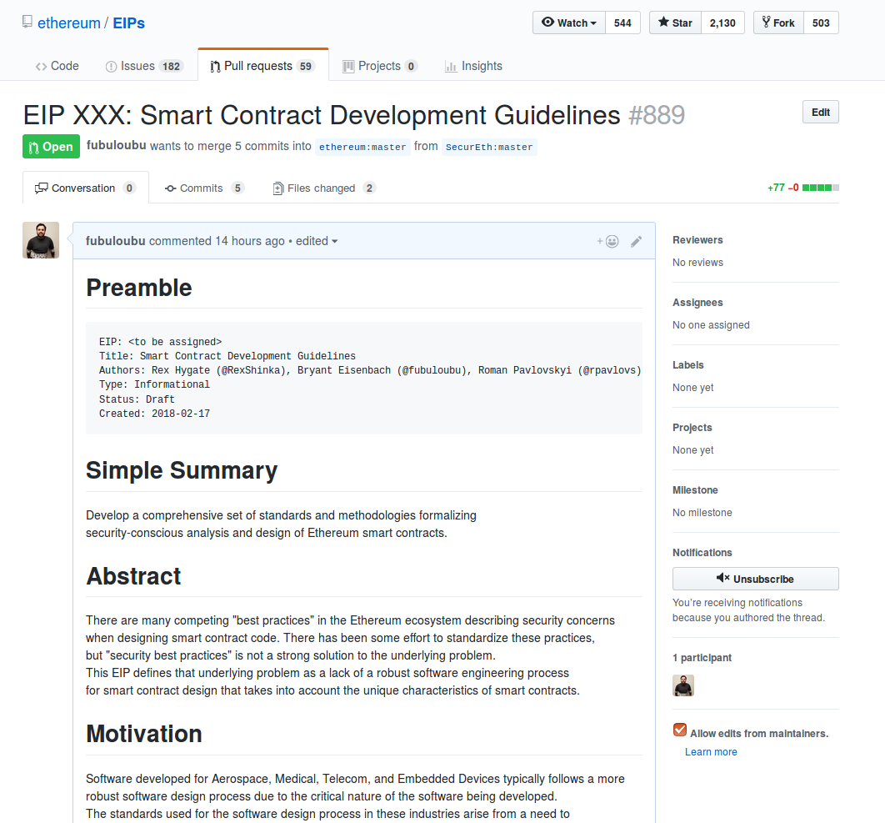

# Risky Business
.left-column.width-50[
Smart contract programming is *Risky Business*
* Small flaws => Large payouts
* $1b in ether lost to date
* A security-first mindset is needed

Industries with a security-first mindset
* Aerospace
* Medical
* Financial
* Embedded Devices

DO-178B serves as our model (Aerospace)
]

OWASP Software Security Risk Model

.right-column.width-50[

Design Assurance Levels

| Risk | Critical | High | Medium | Low | Safe |
| :---: | :---: | :---: | :---: | :---: |
| DAL  | A | B | C | D | E |
]

---

# Standards Body

.left-column.width-50[
SecurEth := Software Engineering Standards Body

Industry Volunteers => Standards Body

Defines
* Standards for Risk Evaluation
* Software Engineering Standards
* Common Language for Ethereum Ecosystem
]

.right-column.width-50[
We made this: 

]

---
class: center white black-background
background-image: url(tool.png)
background-position: top;

# We built a tool!

---
# Adoption

.left-column.width-66[
*But how do guarentee adoption?*

*Software Insurance!*

Smart Contract Policies on other Smart Contracts!
* Software Risk is the metric used to price premiums for policy
* High quality code => Lower Premiums
* When hacks happen, funds aren't all lost!
* This is how we get mainstream adoption!
]

.left-column.width-33[

]
